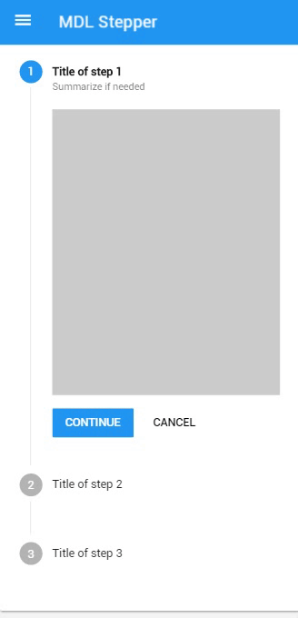
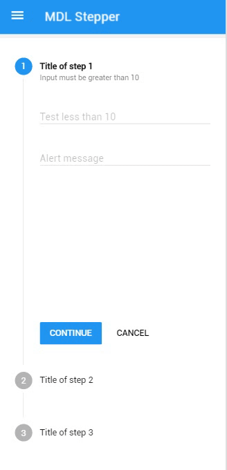

# MDL Stepper

[](https://badge.fury.io/gh/ahlechandre%2Fmdl-stepper)
[](https://badge.fury.io/js/mdl-stepper)

A library that implements to the [Material Design Lite](https://getmdl.io) a polyfill of stepper component specified by [Material Design](https://www.google.com/design/spec/components/steppers.html). The stepper polyfill will help you to implement this material design component today.


## Navigation
* [Get started](#get-started) 
  * [Installation](#installation)
  * [Basic usage](#basic-usage)
* [Steppers](#steppers)
  * [Linear stepper](#linear-stepper) 
  * [Non-linear stepper](#non-linear-stepper) 
  * [Stepper feedback](#stepper-feedback) 
  * [Linear stepper](#linear-stepper) 
  * [Editable steps](#editable-steps) 
  * [Optional steps](#optional-steps) 
  * [Error state](#error-state) 
* [Introduction](#introduction) 
  * [To include a component](#to-include-a-component) 
  * [Configuration options](#configuration-options) 
* [Javascript API](#javascript-api)
  * [Methods](#methods)
  * [Custom events](#custom-events)
  * [Component handler](#component-handler)
  * [MDL component design pattern](#mdl-component-design-pattern)
  * [Dynamically adding a Stepper](#dynamically-adding-a-stepper)
* [Development](#development) 
  * [Source](#source) 
  * [Javascript](#javascript-1) 
  * [CSS](#css) 
* [Why MDL Stepper](#why-mdl-stepper) 
* [License](#license) 

## Use MDL Stepper on your site?

[ahlechandre.github.io/mdl-stepper](https://ahlechandre.github.io/mdl-stepper/)

# Get started

The MDL Stepper component was based on Material Design Lite (MDL) library. To use this component before you will need to include the [MDL](https://getmdl.io) to your project.

## Installation

### Download (zip)

You can [download](https://github.com/ahlechandre/mdl-stepper/archive/master.zip) the current version of repository compacted.

### Build

```bash
# Clone the repository.
git clone git@github.com:ahlechandre/mdl-stepper.git
# Access created folder.
cd mdl-stepper
```

Goes to [development](#development) section for details.

### NPM

```bash
npm install --save mdl-stepper
```

### Bower

```bash
bower install mdl-stepper
```

## Basic usage

1. Choose the type of [download](http://getmdl.io/started/index.html#download) and include the Material Design Lite files to your all pages.

2. Get the CSS & Javascript files of MDL Stepper component.

3. Include the Material Design Lite + Stepper files.

### CSS & Icons

```html
<!-- Material Design Lite CSS -->
<link rel="stylesheet" href="https://code.getmdl.io/1.1.3/material.blue-pink.min.css" />
<!-- MDL Stepper CSS -->
<link rel="stylesheet" href="./stepper.min.css">
<!-- Material Icons -->
<link rel="stylesheet" href="https://fonts.googleapis.com/icon?family=Material+Icons">
```

### Javascript
> **Note:** Make sure that you are loading the javascripts in the correct order.

```html
<!-- Material Design Lite JS -->
<script defer src="https://code.getmdl.io/1.1.3/material.min.js"></script>
<!-- MDL Component JS -->
<script defer src="./stepper.min.js"></script>
<script>
  (function () {
    window.addEventListener('load', function () {
      // Your custom code in "onload" callback.
    });
  })();
</script>
```

### Component

```js
// Select your stepper element.  
var stepperElement = document.querySelector('ul.mdl-stepper');
// Get the instance of componet for control over API.
var Stepper = stepperElement.MaterialStepper;
// Goes to the next step.
Stepper.next();
```

# Steppers

The types of steppers and steps are specified in [Material Design page](https://www.google.com/design/spec/components/steppers.html).

### Linear stepper
Linear steppers require users to complete one step in order to move on to the next. (Material Design)


### Non-linear stepper
Non-linear steppers allow users to enter a multi-step flow at any point. (Material Design)


### Stepper feedback
Steppers may display a transient feedback message after a step is saved. Stepper feedback should only be used if there is a long latency between  steps. (Material Design)



### Editable steps
Editable steps allow users to return later to edit a step. These are ideal for workflows that involve editing steps within a session. (Material Design)


### Optional steps
Optional steps within a linear flow should be marked as optional. (Material Design)


### Error state


# Introduction

"Steppers display progress through a sequence by breaking it up into multiple logical and numbered steps. Avoid using steppers to break up sections in a short form, or multiple times on one page". Goes to [Material Design spec](https://www.google.com/design/spec/components/steppers.html)  page.

## To include a component

See component [markup details](https://ahlechandre.github.io/mdl-stepper/component/index.html).

## Configuration options

Class | Effect | Remarks
------|--------|------
```mdl-stepper```  | Defines a stepper container. |Required
```mdl-stepper--linear```  | Defines the stepper as linear and require users to complete one step in order to move on to the next. | Manually added
```mdl-stepper--horizontal```  | Defines the stepper as horizontal type, the step name and numbers appear on a horizontal bar. | Manually added
```mdl-stepper--feedback```  | Display a transient feedback message after a step is saved. | Manually added
```mdl-step```  | Defines a step item inside `mdl-stepper`. | Required
```is-active```  | Defines the active step. The first step will be marked as active if you don't set it. | Manually added
```mdl-step--optional```  | Defines a step as optional. | Manually added
```mdl-step--editable```  | Defines a step as editable after saved. | Manually added
```mdl-step__label```  | Defines the label section of step. | Required
```mdl-step__title```  | Defines title part of label. Must be inside a `mdl-step__label`. | Required
```mdl-step__title-text```  | Defines the text content of title. Must be inside a `mdl-step__title`. | Required
```mdl-step__title-message```  | Defines an addtional text to the title (e.g. Optional). Must be inside a `mdl-step__title`. | Manually added
```mdl-step__content```  | Defines the content section of step. | Required
```mdl-step__actions```  | Defines the actions section of step | Required

# Javascript API

Methods and custom events to the control over Stepper instance. 

## Methods

Method | Effect | Return
------|--------|------
```MaterialStepper.next()```  | Complete the current step and move one to the next. Using this method on editable steps (in linear stepper) it will search by the next step without "completed" state to move. When invoked it dispatch the event onstepcomplete to the step element. | `boolean` - True if move and false if not move (e.g. On the last step)  
```MaterialStepper.back()```  | Move to the previous step without change the state of current step. Using this method in linear stepper it will check if previous step is editable to move. | `boolean` - True if move and false if not move (e.g. On the first step) 
```MaterialStepper.skip()```  | Move to the next step without change the state of current step. This method works only in optional steps. | `boolean` - True if move and false if not move (e.g. On non-optional step)
```MaterialStepper.error(message)```  | Defines the current step state to "error" and shows the `message` parameter on title message element. When invoked it dispatch the event onsteperror to the step element. | `undefined`
```MaterialStepper.goto(id)```  | Move "active" to specified step `id` parameter. The id used as reference is the integer number shown on the label of each step (e.g. 2). | `boolean` - True if move and false if not move (e.g. On id not found)
```MaterialStepper.getActiveId()```  | Get the current "active" step element id on the stepper. The `id` used as reference is the integer number shown on the label of each step (e.g. 2). | `number`  
```MaterialStepper.getActive()```  | Get the current "active" step element on the stepper. | `HTMLElement`   

## Custom Events

Event | Target | Fired
------|--------|------
```onstepcancel```  | .mdl-step | 	When the step action button/link with `[data-stepper-cancel]`  attribute is clicked.
```onstepcomplete``` | .mdl-step | When `MaterialStepper.next()` method is called on step and it returns `true`.
```onsteperror``` | .mdl-step | When `MaterialStepper.error(message)` method is called on step.
```onstepnext``` | .mdl-step | When the step action button/link with `[data-stepper-next]` attribute is clicked.
  ```onstepskip``` | .mdl-step | When the step action button/link with `[data-stepper-skip]` attribute is clicked.
```onsteppercomplete``` | .mdl-stepper | When all required steps are completed. Optional steps are ignored for dispatch this event.

## Component handler

The Stepper follows **MDL component design pattern** and uses the [component handler](https://github.com/jasonmayes/mdl-component-design-pattern) to register and upgrades the component.

```js
if (typeof window.componentHandler !== 'undefined') {
  // componentHandler is sucessfully loaded and available globally.
}
```

### MDL component design pattern
> A design pattern that elegantly handles the registration of new components such that DOM upgrades are automatically performed on document load, as well as making it super easy to handle upgrades of elements that may be added after initial page load. It even ensures elements can never be "double" (or more) upgraded, whilst allowing any HTMLElement to be upgraded to multiple component types. 

### Dynamically adding a Stepper

If you need to include a Stepper after initial page load (by an asynchronous request for example), you will have to manually upgrades the component.

```js
// Gets your stepper element added after initial page load.
var stepperElement = document.querySelector('.mdl-stepper');

// The component instance is not upgraded and so not defined.
console.log(typeof stepperElement.MaterialStepper); // undefined

// Upgrades all registered components found in the current DOM. 
// This is automatically called on window load.
componentHandler.upgradeAllRegistered();

// At this point, component handler already upgraded
// the Stepper component and assigned the instance for 
// control over API.
console.log(typeof stepperElement.MaterialStepper); // object
```

Instead of upgrade all registered (recommended) you can upgrade only the Stepper element using:

```js
// Gets your stepper element added after initial page load.
var stepperElement = document.querySelector('.mdl-stepper');

// Upgrades a specific element rather than all in the DOM.
componentHandler.upgradeElement(stepperElement);
```

# Development

## Source

```bash
# Clone the repository.
git clone git@github.com:ahlechandre/mdl-stepper.git
# Access created folder.
cd mdl-stepper
```

## Javascript

```bash
# Inside mdl-stepper/ folder.
# Install dev dependencies.
npm install
# Build a development version of javascript changes.
npm run dev
# Build a production version of javascript changes.
npm run prod
# Build a production version of javascript changes on WINDOWS.
# npm run prod-windows
```

## CSS

```bash
# First, make sure that you have SASS installed (http://sass-lang.com/install).
sass --version
# $ Sass x.x.x
# Inside mdl-stepper/ folder.
cd src
# ~/mdl-stepper/src
# Build a development version of css changes.
sass mdl-stepper.scss:../stepper.css
# Build a production version of css changes.
sass mdl-stepper.scss:../stepper.min.css --style compressed
```

# Why MDL Stepper

As discussed at [#1748](https://github.com/google/material-design-lite/issues/1748) issue, the stepper is a component that is present in the Material Design specification and MDL has not support yet.

While the Material Design Lite team works in other parts of the library, i decided to create my own component.

Obviously, this is my interpretation of the spec and it does not reflect what the Material Design team would consider ‘correct’ but i tried to preserve as much of specified details.

You can consider this as a polyfill to be used while the MDL do not include that. Maybe it can be useful and help other people to build their web apps.

# License 

[MIT License](https://github.com/ahlechandre/mdl-stepper/blob/gh-pages/LICENSE) © 2016 Alexandre Thebaldi
